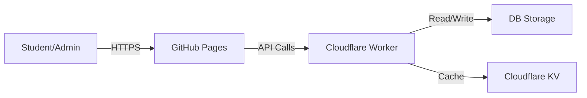

<div align="center">

# BIT GROUP C Attendance System

### Beautiful, secure attendance marking system built with React and Cloudflare Workers


</div>

---

## ✨ Features

<table>
<tr>
<td width="50%">

### Student Portal
- Student portal for marking attendance
- Secure PIN verification system
- Intuitive search functionality
- Instant attendance confirmation

</td>
<td width="50%">

### Admin Dashboard
- Comprehensive student management
- Real-time attendance statistics
- Toggle attendance status
- Detailed analytics and reports

</td>
</tr>
<tr>
<td width="50%">

### Security Features
- Advanced fraud detection
- Automatic blacklist management
- Device fingerprinting
- IP logging and monitoring

</td>
<td width="50%">

### Deployment
- GitHub Pages hosting
- Cloudflare Workers backend
- High availability and performance

</td>
</tr>
</table>

---

## 🚀 Quick Start

### Prerequisites

Before you begin, ensure you have the following installed:

```bash
Node.js v16+
Git
```

### Installation

Clone the repository and install dependencies:

```bash
# Clone repository
git clone https://github.com/codelabwithosman/bit-attendance.git
cd bit-attendance

# Install dependencies
npm install

# Start development server
npm start
```

### Deployment

Build and deploy the application to production:

```bash
# Build for production
npm run build

# Deploy to GitHub Pages
npm run deploy
```

---

## 📖 Usage

### Student Portal

<details>
<summary>Click to expand instructions</summary>

Follow these steps to mark your attendance:

1. Navigate to [https://codelabwithosman.github.io/bit-attendance](https://codelabwithosman.github.io/bit-attendance)
2. Search for your name or index number
3. Enter your PIN (last 4 letters of surname OR last 5 digits of index)
4. Your attendance will be marked automatically

</details>

### Admin Panel

<details>
<summary>Click to expand instructions</summary>

Access the administrative interface:

1. Navigate to the `/admin` route
2. Enter the admin PIN to authenticate
3. Manage students, toggle attendance status, and view comprehensive statistics

</details>

---

## 🏗️ Architecture

The system is built on a modern, scalable architecture:

<div align="center">

| Component | Technology |
|-----------|------------|
| **Frontend** | React + React Router (GitHub Pages) |
| **Backend** | Cloudflare Worker API | Node.js |

</div>



---

## 🔒 Security Features

The system implements multiple layers of security:

<table>
<tr>
<td width="33%">

**Device Fingerprinting**

Unique device identification for tracking

</td>
<td width="33%">

**IP Logging**

Track and monitor access patterns

</td>
<td width="33%">

**Session Management**

Tokens with 30-minute expiry

</td>
</tr>
<tr>
<td width="33%">

**Fraud Detection**

Automatic tracking of suspicious attempts

</td>
<td width="33%">

**Blacklist System**

Automatic blocking of malicious actors

</td>
<td width="33%">

**Protected Records**

Critical student data cannot be deleted

</td>
</tr>
</table>

---


---

## 🛠️ Technologies Used

<div align="center">


</div>

---

## 📝 License

This project is licensed under the **MIT License**.

---

<div align="center">

### Built with care for BIT GROUP C

⭐ Star this repository if you find it helpful!

[Report Bug](https://github.com/codelabwithosman/bit-attendance/issues) · [Request Feature](https://github.com/codelabwithosman/bit-attendance/issues)

</div>
